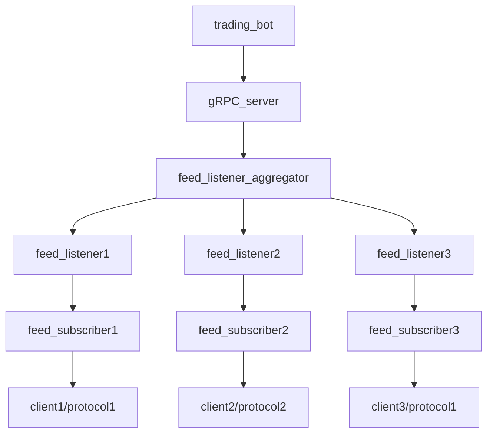
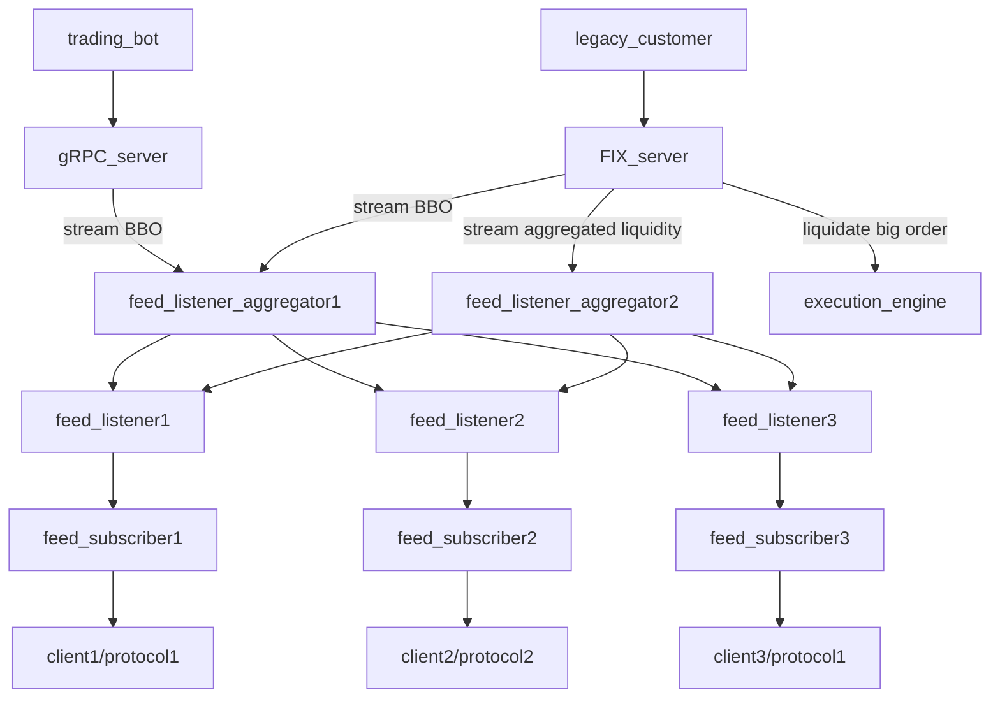

# DragonflyBot
A vertically scalable stream processing framework focusing on low latency, helping you scale
and consume financial data feeds.

## Design
The framework consists of 5 layers where each layer can be easily extended and can have its own
builder.

### Client/protocol layer
Here different clients (supporting different protocols) can be defined e.g. we can have a 
builder for WebSockets clients and a different builder for FIX clients.

### Feed subscriber layer
Now that we have a connected client, each client/protocol in general require different subscription
approaches e.g. a FIX connection might require different methods than a WebSocket connection. We
can simply define the requirements or extend them on this layer. 

### Feed listener layer
Feed listeners are already subscribed to feeds (i.e. they require an active subscriber) and 
deal only with processing/responding to the data e.g. forward the message only if top of the order
book has changed.

### Feed listener aggregator layer
In practice, we connect to multiple feeds/venues. If we want to get a world view of all, we need to 
consume what the feed listeners are emitting in one place/worker. Doing this we can e.g. consume
all the order book messages emitted (and filtered) from feed listeners and construct top best bid,
best offer (BBO) of all order books (constructing BBO world view).

### Service layer
The final layer - the place where you define your services which consume from feed listener 
aggregators and serve your subscribers e.g. a bot could subscribe to your service to get a BBO
world view.

## Allowed topologies
Since the layers are connected only with message passing queues, we can quickly change topologies
from simple ones

to more complex ones

simply by changing the type of the queue (MPSC to e.g. SPMC) and introducing transformers if needed.

## Performance considerations
### WebSocket client
Based on [WS benchmarks](https://github.com/nurmohammed840/web-socket-benchmark),
[websocket.rs](https://github.com/nurmohammed840/websocket.rs) provides the fastest WS client. However, 
TLS doesn't seem to be supported. The second fastest - `fastwebsockets` supports TLS and reading
single frames. So if we're only interested in top of the book, we could only read a part of the whole
message i.e. read only the frames needed to get top N BBO. 

### JSON document parsing
Since we're only interested in top level access (getting bids/asks), we can go with property based 
parsing libs which are [up to 4x faster than libs which parse the whole JSON](https://github.com/AnnikaCodes/rust-json-parsing-benchmarks).

### Alternative allocators
`tikv-jemallocator` is used for improving the performance of allocations.

### Other opportunities
For small vectors `SmallVec` could be used.


## Usage
To run an example where we aggregate order books and publish top 10 via a gRPC server:
```shell
# build a release image
DOCKER_BUILDKIT=1 docker build -t dragonflybot:latest .

# run the server in the background
docker run \
  --name dragonflybot_grpc_server \
  --rm \
  --user="$(id -u):$(id -u)" \
  --group-add="$(id -u)" \
  -p 127.0.0.1:50051:50051 \
  dragonflybot:latest \
  dragonflybot-grpc-server --instrument-name ethbtc &
 
 # run the gRPC client
 docker run \
  --name dragonflybot_grpc_client \
  --rm \
  --user="$(id -u):$(id -u)" \
  --group-add="$(id -u)" \
  --net="host" \
  dragonflybot:latest \
  dragonflybot-grpc-client
  
  # to stop containers
  docker stop dragonflybot_grpc_client \
  && docker stop dragonflybot_grpc_server
```

## Developing
For developing a multi stage, multi branch Dockerfile, supporting Rust build cache via `cargo-chef` is available.
```shell
# run tests
cargo test

DOCKER_BUILDKIT=1 docker build --build-arg "BUILD_PROFILE=dev" -t dragonflybot_dev:latest .
```